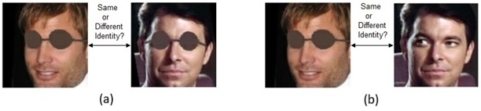
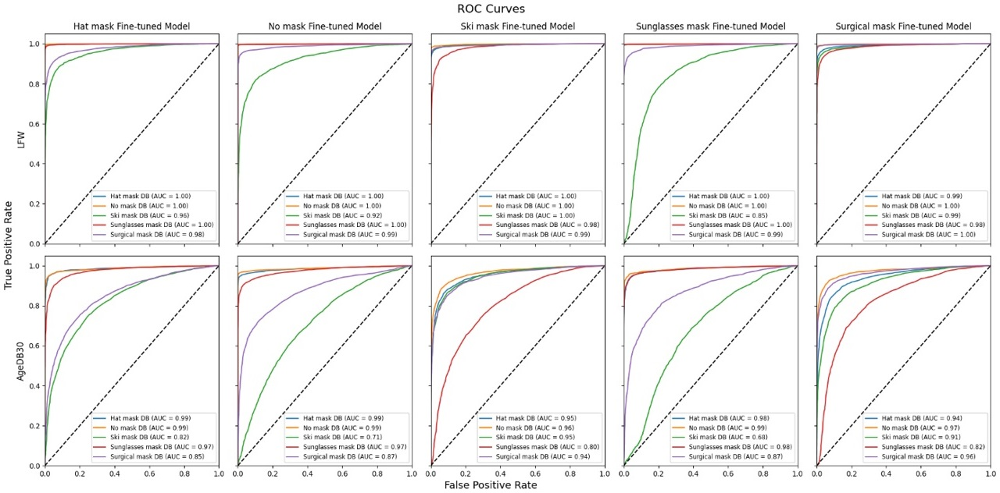
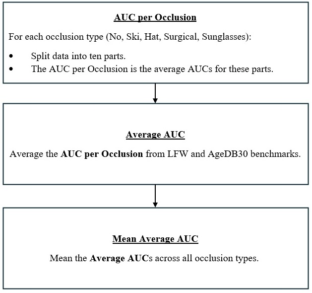
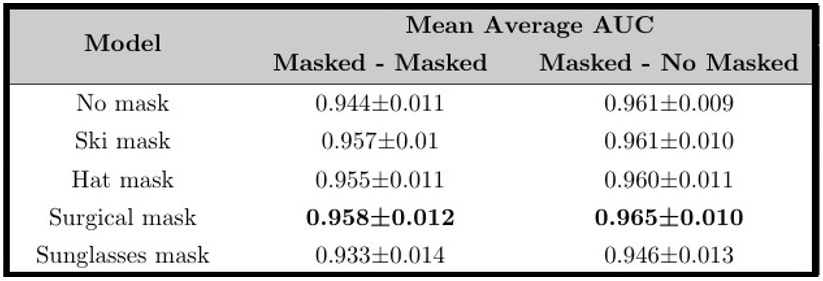
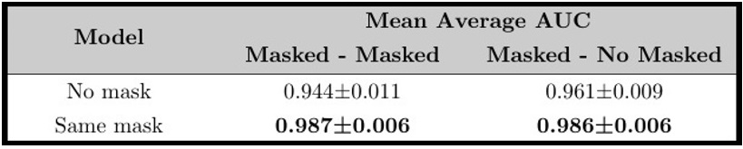

## Summary
Brief summary of the analysis results.

🧪 Testing scenarios:
  
Two scenarios of Face verification were tested on the Sunglasses, Hat, Surgical and Ski masks:

a.  Masked-Masked: A comparison between two masked facial images.

b.  Masked-No Masked: A comparison between a masked facial image and an unmasked facial image.

  

📊Analysis Findings:

We conducted an extensive analysis on the LFW and AgeDB30 benchmarks and the synthetically occluded version of them. Since we had a large amount of data, as shown in the ROC plots for the masked-masked scenario below.

  

We introduced a metric to obtain a single value for each model, aiming to enhance our understanding of the results. We named the metric - “Mean Average AUC”, calculated as follows:

  

Here are the results of our study:
1.	When the type of occlusion is not known in advance:

  

2.	When the type of occlusion is known in advance:

  

🎯Summary and Conclusions:

1.	Notably, fine-tuning the model based on a known occlusion type led to significant improvements.

2.	Interestingly, even out-of-the-box face recognition systems achieved high accuracy in identifying occluded faces but fine-tuning on occluded face images further enhanced performance.
