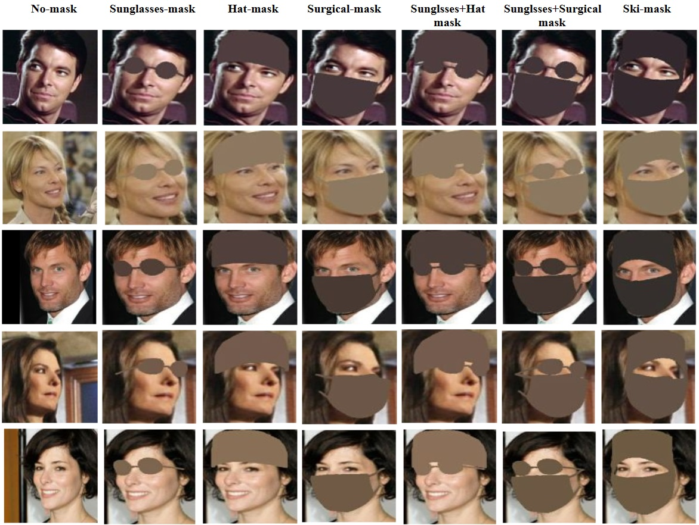

# Face Recognition Of Masked Faces

## Table of Contents
- [TL;DR](#tldr)
- [Introduction](#introduction)
- [Pipeline](#pipeline)
- [Analysis](#analysis)
- [Installation](#installation)
- [Usage](#usage)
- [License](#license)

## TL;DR
We introduce a process to generate synthetic occlusion masks in an unconstrained environment, including these types:

🕶️ Sunglasses masks

🧢 Hat masks

😷 Surgical masks

🧢 Hat + 🕶️ Sunglasses masks

🕶️ Sunglasses + 😷 Surgical masks

🎿 Ski masks (Keffiyeh)

Example:
<p align="center">
  
</p>


Additionally, we present key findings and analysis of the performance of State-Of-The-Art Face Recognition on these masks, including their fine-tuned versions for specific occlusion types.

## Introduction
This repository contains the work done as part of my Master's in Computer Science at the Open University. In recent years, significant progress has been made in the field of Face Recognition (FR), with numerous models demonstrating increasingly better performance. However, the presence of occlusions can adversely affect their effectiveness. This raises the question, “To what extent does occlusion contribute to performance degradation?”. To answer these question, a generative process for creating real-world synthetic occlusion masks for faces capture in unconstrained conditions is needed.

Consider a potential scenario: If a robber enters a bank wearing a ski mask, would contemporary FR models be capable of handling such an occlusion? Recent research on facial occlusions has focused on comparing baseline methods with novel approaches or conducting tests under unrealistic conditions, such as laboratory settings (e.g., AR dataset). Although these studies have shed light on the impact of various occlusions on Facial Verification (FV) techniques, there is still a lack of comprehensive and conclusive findings for typical real-life occlusions within the current research domain. 

## Pipeline

The appropriate Data has been generated by applying a “covering” to the original images using a 3D Morphable Mode (3DMM), which was projected onto 2D images.
Below is an example of the 3DMM model with a surgical mask:

<p align="center">
  
</p>

The whole process illustrated below:
<p align="center">
  
</p>

## Analysis
Please check the the [Analysis](https://github.com/orlevit/Face-Recognition-Of-Masked-Faces/tree/main/Analysis) directory.

## Installation
The process was ran with Python 3.12.3.

1. Git clone the repository recursively:
```
git clone --recurse-submodules -j8 https://github.com/orlevit/my-Face-Recognition-Of-Masked-Faces.git
```
2. Download the [img2pose model](https://drive.google.com/file/d/1OvnZ7OUQFg2bAgFADhT7UnCkSaXst10O/view) model and put it inside img2pose directory.
3. Install [Pytorch](https://pytorch.org/get-started/locally/) for your specific configuration.
4. Install python packages with:
```
python install -r requirmentx.txt
```

## Usage
To run the main script, navigate to the project directory and use the following command:

```
python main.py -h
```
This will display a help message with the available options:
```
usage: main.py [-h] [-i INPUT] [-o OUTPUT] [-e IMAGE_EXTENSIONS] [-m MASKS] [-t THRESHOLD] [-b BBOX_IND] [-inc INC_BBOX] [-ch CHUNK_SIZE] [-cpu CPU_NUM]

options:
  -h, --help            show this help message and exit
  -i INPUT, --input INPUT
                        Directory with input images or csv file with paths.
  -o OUTPUT, --output OUTPUT
                        Output directory.
  -e IMAGE_EXTENSIONS, --image-extensions IMAGE_EXTENSIONS
                        The extensions of the images.
  -m MASKS, --masks MASKS
                        Which masks to create.
  -t THRESHOLD, --threshold THRESHOLD
                        The minimum confidence score for img2pose for face detection
  -b BBOX_IND, --bbox-ind BBOX_IND
                        Return the original or cropped bounding box image with mask
  -inc INC_BBOX, --inc-bbox INC_BBOX
                        The increase of the bbox in percent
  -ch CHUNK_SIZE, --chunk-size CHUNK_SIZE
                        The chunk size per worker
  -cpu CPU_NUM, --cpu-num CPU_NUM
```
Example Usage:
```
python main.py -i /input_image_directory -o /output_image_directory
```
## License
This project is licensed under the [MIT License](https://en.wikipedia.org/wiki/MIT_License).

